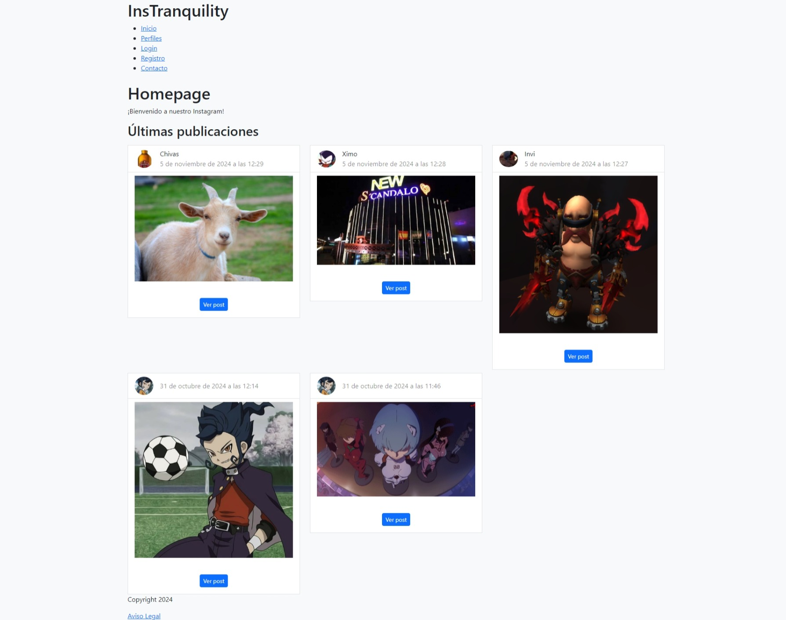
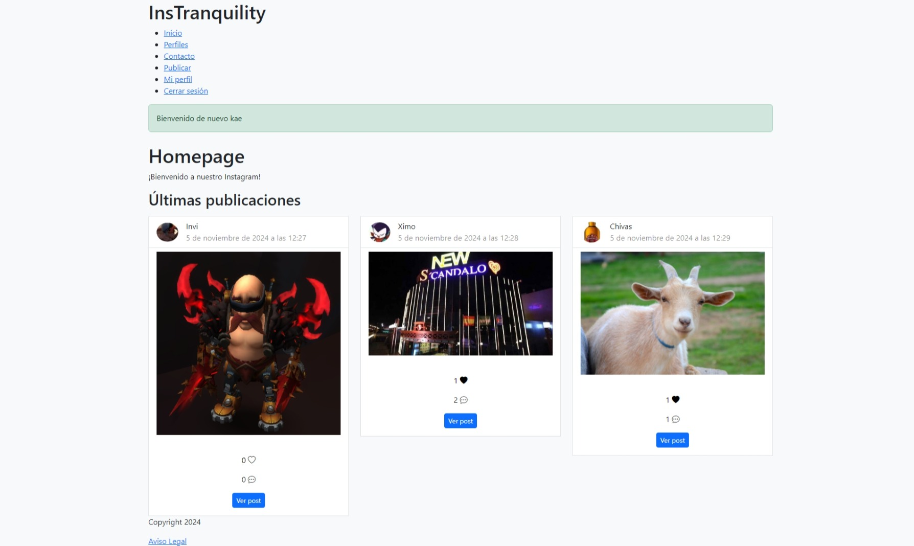
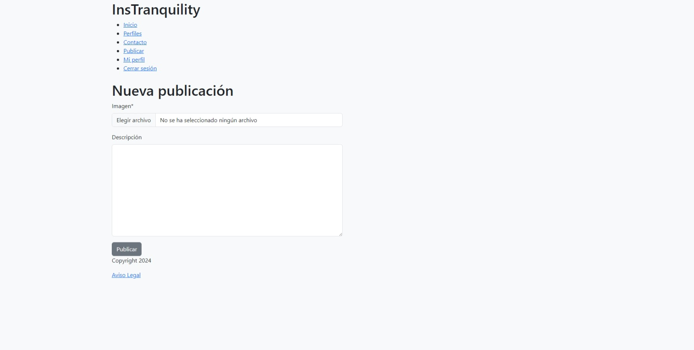
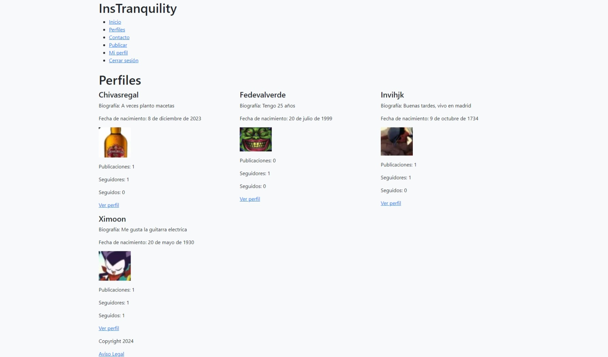
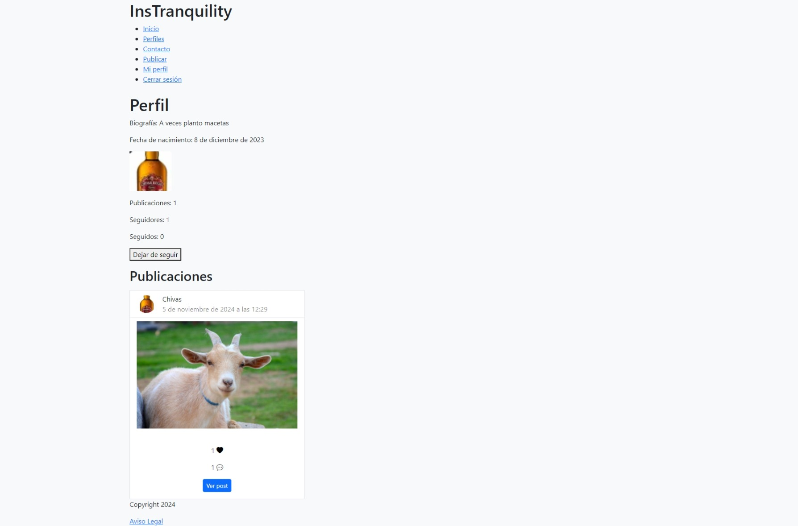
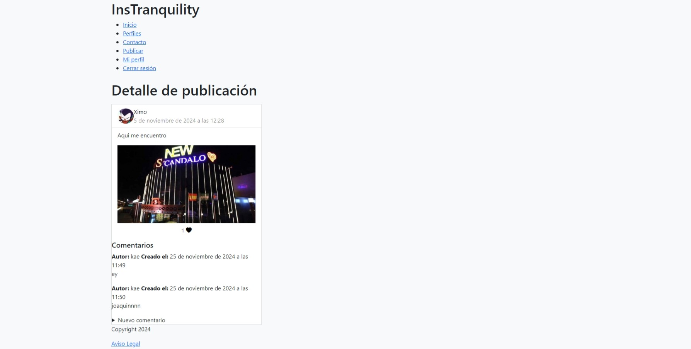

## ESP:

# Clon de Instagram 📷📸

Clon de instagram utilizando django y un poco de bootstrap, aunque apenas tiene estilos

## 🎯 Objetivo del Proyecto

El objetivo ha sido aprender mas en profundidad sobre Django. Se utiliza una base de datos MySQL

## 👁️ Vista previa del proyecto

### Home sin logearse


### Home logeado


### Vista de nueva publicacion


### Vista de perfil de un usuario


### Vista detalle de un perfil de usuario


### Vista detalle de una publicacion



## 🛠️ Estructura del Proyecto

El proyecto está organizado en varias carpetas y archivos para facilitar su mantenimiento y expansión:
El proyecto se divide en varias apps, como posts que recoge todas las funcionalidades de posts, profiles y la app principal del proyecto 
**manage.py**: Fichero que recoge las funcionalidades y manejo de django.
**requirements.txt**: Fichero que recoge los requerimientos que hacen falta para que el proyecto funcione adecuadamente. Se deberán instalar en un nuevo entorno virtual


## 🚀 Funcionalidades y uso

- **Registro**: La página cuenta con un formulario para registrar usuarios que quedarán guardados en la base de datos. Es muy importante registrarse para
  poder utilizar todas las funcionalidades del proyecto, ya que el proyecto tiene vistas protegidas y funciones protegidas.
  
- **Iniciar sesión**: Podrás logearte con tu usuario. Cuando inicias sesion, solo ves las publicaciones de los perfiles que sigues
  
- **Agregar publicaciones**: Puedes subir las fotos que desees con una descripción

- **Lista de perfiles**: Podrás ver una lista de usuarios que tienen una cuenta, con sus seguidores, numero de publicaciones y siguiendos

- **Posibilidad de seguir usuarios**: Existe la funcionalidad de seguir o dejar de seguir usuarios

- **Dar Like o quitar like**: Se puede dar like o quitar like a las publicaciones

- **Dejar comentario en las publicaciones**: Se puede dejar comentarios en cada publicacion de los usuarios

- **Contador de seguidores, siguiendos y publicaciones** Un contador para cada perfil para saber cuantas personas sigue un usuario, le siguen o cuantas publicaciones tiene
- 
- **Vistas protegidas**: Para realizar todas las funcionalidades debemos registrarnos y logearnos

- **Bootstrap**: Estilos minimos con un poco de bootstrap


## 🛠️ Instalación y Ejecución

1. Clona este repositorio:
   ```bash
   https://github.com/kaeedev/Instagram.git

2. Crea un entorno virtual en el proyecto para instalar las dependencias necesarias:
   ```bash
   python3 -m venv venv
   
   ```
   o
   ```bash
   python -m venv venv
   ```

3. Inicia el entorno virtual que has creado:
   ```bash
   source venv/bin/activate

4. Instala las dependencias necesarias:
   ```bash
   pip install -r requirements.txt
   ```

5. Ejecuta el programa:
   Deberás runear un servidor local
   ```bash
   python manage.py runserver
   ```

6. Usar el admin de django si lo deseas:
   ```bash
   Añadir /admin al final del enlace del servidor local

## 📝 Licencia

Este proyecto está disponible únicamente para uso **docente** y con fines de aprendizaje.

### Condiciones:
- El código fuente de este proyecto puede ser usado, modificado y distribuido solo con fines educativos.

Si tienes alguna duda o quieres utilizar algún recurso de este proyecto, por favor contacta conmigo.

